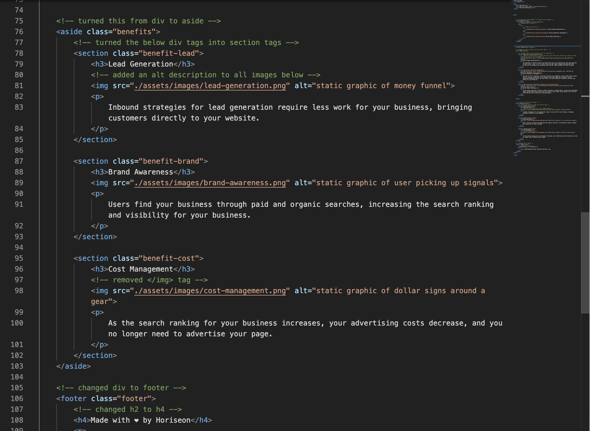

# 01 HTML CSS Git: Code Refactor Assignment

## What, Why, and How
With this assignment, I was motivated to make the website more accessible and easy to read. To do this:
1. I changed the title element to make it more descriptive
2. I replaced all "div" with semantic elements
3. I made sure the HTML and CSS flowed properly and did not have any excess/unecessary code
4. I added alt descriptions to all of the images
5. I made sure that the heading attributes were all in sequential order

The goal is that anyone using a screen reader can now more easily understand the content of the page. Another goal was to make the code easier to read for anyone deciding to take a look at the HTML and CSS. 

Through this process, I learned that a website can be coded in different ways, but look exactly the same. I learned that making a site more accessible isn't only a considerate thing to do for those with accessibility challenges, but also makes the code easier to understand for others who read it. I learned that just because a website looks good doesn't mean that there isn't any unecessary/pointless code that can be rooted out and deleted. These are all valuable lessons that I didn't know before doing this project. 

Finally, since I haven't looked at my peers' work on this assignment, I don't know how my project would stand out in comparison to my peers. I do believe, however, that as a webpage my work stands out because it improves the SEO of the page, makes it more accessible, and has (fairly) clean code. I put in a lot of work and played around with the code a lot to understand what was going on, and I'm proud of the final product. 

Note: You can find the exact changes detailed within the HTML and CSS documents themselves.  

## Link
Link to website: https://andrew1835.github.io/code-refractor/

## Screenshot 

Below is a screenshot of what the website looks like upon load

 

Below is a screenshot of a sample of the code that I refracted to make more accessible

